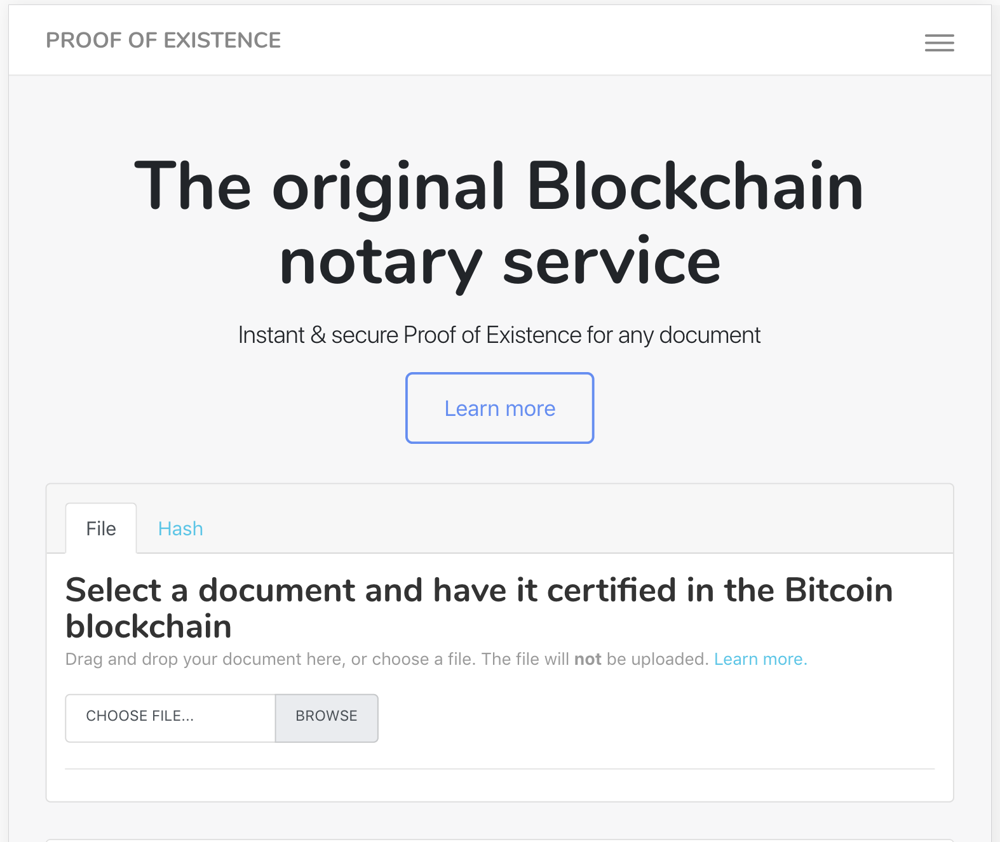

# Proof of Existence

The original Blockchain notary service, offering instant, anonymous, distributed, and secure proof of existence for any document, agreement, or contract.

 
 

---

## What is Proof of Existence?

A service to anonymously and securely store an online distributed proof of existence for any document. **Your documents are NOT stored in our database or in the bitcoin blockchain**, so you don't have to worry about your data being accessed by others.

What is stored is a cryptographic digest of the file, linked to the time in which you submitted the document. In this way, you can later certify that the data existed at that time. This is the first online service allowing you to publicly prove that you have certain information without revealing the data or yourself, with a decentralized certification based on the [bitcoin network](http://bitcoin.org/).

The key advantages are anonymity, privacy, and getting a decentralized
proof which can't be erased or modified by anyone (third parties or
governments). **Your document's existence is permanently validated by
the blockchain even if this site is compromised or down**, so you don't
depend or need to trust any central authority. All previous data
timestamping solutions lack this freedom.

---

## Common uses

##### Demonstrating data ownership without revealing actual data.

You can publicly reveal the digest and if conflict arises you can prove
you had the data that generates the digest. Useful for copyrighted
material, patents, etc.

##### Document timestamping.

You can prove certain data exists at a certain moment of time. As we use
the [bitcoin blockchain](https://blockchain.info/) to store the document
proof, you can certify the existence of your document without the need
of a central authority. Use the computing power of the whole bitcoin
network to certify your data.

##### Checking for document integrity.

If you store a proof for your document and later re-upload it, the
system will only recognize it if it is completely and fully the same
document. The slightest change, and we'll recognize it is different,
giving you the security that certified data can't be changed.

---

## Technical foundations

The document is certified via embedding its
[SHA256](https://en.wikipedia.org/wiki/SHA-2) digest in the bitcoin
blockchain. This is done by generating a special bitcoin transaction
that encodes/contains the hash via an [OP\_RETURN
script](https://en.bitcoin.it/wiki/OP_RETURN). This is a [bitcoin
scripting opcode](https://en.bitcoin.it/wiki/Script) that marks the
transaction output as [provably
unspendable](https://en.bitcoin.it/wiki/Script#Provably_Unspendable.2FPrunable_Outputs)
and allows a small amount of data to be inserted, which in our case is
the document's hash, plus a marker to identify all of our transactions.

Once the transaction is confirmed, the document is permanently certified
and proven to exist at least as early as the time the transaction was
confirmed. If the document hadn't existed at the time the transaction
entered the blockchain, it would have been impossible to embed its
digest in the transaction (This is because of the hash function's
property of being [second pre-image
resistant](http://en.wikipedia.org/wiki/Cryptographic_hash_function#Properties)).
Embedding some hash and then adapting a future document to match the
hash is also impossible (due to the [pre-image resistance of hash
functions](http://en.wikipedia.org/wiki/Cryptographic_hash_function#Properties)).
This is why **once the bitcoin blockchain confirms the transaction
generated for the document, its existence is proven, permanently, with
no trust required**.

If anyone wants to manually confirm the document's existence at the
timestamped time, they should just follow these steps:

-   Calculate the document's SHA256 digest.
-   Find a transaction in the bitcoin blockchain containing an
    OP_RETURN output with the document's hash prepended by our marker
    bytes, which are 0x444f4350524f4f46 (or 'DOCPROOF' in ascii).
-   Some online services like [Coin Secrets](http://coinsecrets.org/) or
    [blockchain.info's list](https://blockchain.info/strange-transactions) can help you locate OP_RETURN transactions more easily.
-   The existence of that transaction in the blockchain proves that the
    document existed at the time the transaction got included into a
    block.

---

## Try it now

Read the [Get Started](get-started.md) section to run your own instance or try it [online](http://proofofexistence.com) first.

You can reach for us on [Twitter](https://twitter.com/profxstence) or [Github](https://github.com/proofofexistence).

---

[Proofofexistence.com](http://proofofexistence.com) is website dedicated to host and support the community of users ot the PoE protocol.

It is powered by [Poex](https://poex.io).
