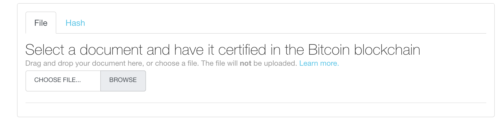
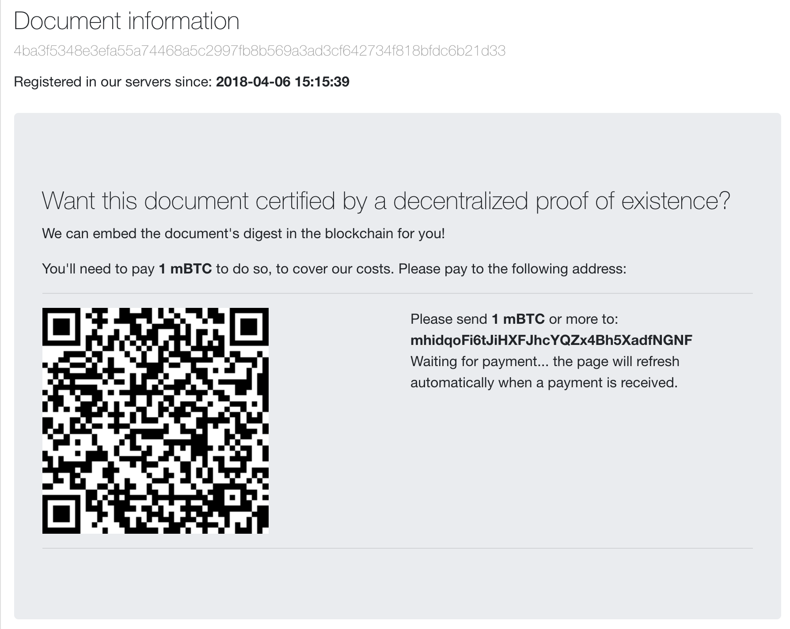
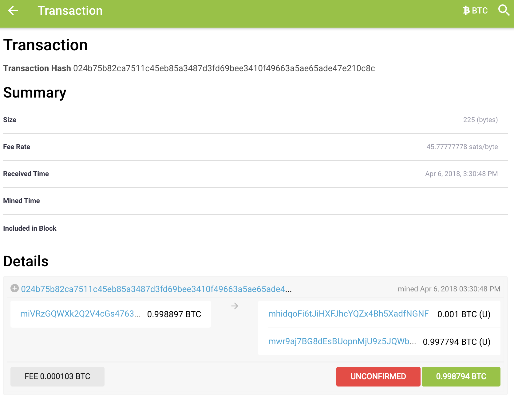
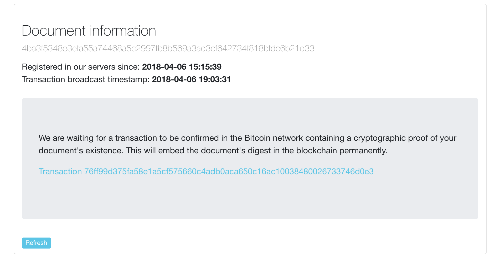
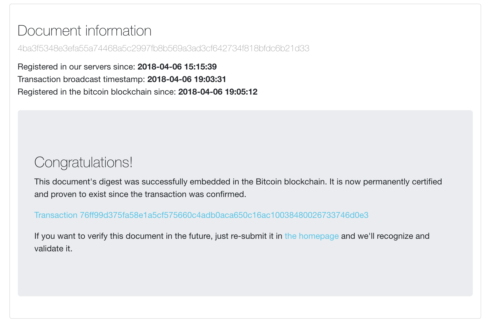

# Your first proof

Now we will learn how to create your first proof of existence of a document in the BTC blockchain.

For this example, we will use the [Bitcoin Test Network (testnet)](https://en.bitcoin.it/wiki/Testnet) which is an alternative blockchain used for testing purposes.

For this tutorial, you can use the [online service](http://proofofexistence.com) or [your own instance](./get-started). If you run your own, make sure that your config file is pointing to Testnet (report to the [config docs](./config) if any doubt).


## Create your wallet

To store and spend coins, you need a wallet. In this tutorial, we will use [bcwallet](https://github.com/blockcypher/bcwallet) which is a command-line tools made with Python. There may be some easier services available online but we are trying to understand how things work here.

To install, simply use `pip`:

    pip install bcwallet


Now, let's create our first wallet.

```
$ bcwallet

Welcome to bcwallet!

...

Which currency do you want to create a wallet for?
1: Bitcoin
2: Bitcoin Testnet
3: Litecoin
4: Dogecoin
5: BlockCypher Testnet
```

We will use the `2: Bitcoin Testnet`.  
By following the rest of the instructions on the terminal, you should obtain two keys (one private and one public).

You can now launch your wallet by using your private key

     $ bcwallet --wallet=YOUR_PRIVATE_WALLET_KEY


## Get some test coins

As you can see, there is no coin in your wallet... yet :)

```
$ bcwallet --wallet=YOUR_PRIVATE_WALLET_KEY

...

Balance: 0.00 bits
Transactions: 0

```

To obtain some test coins (of no value, sorry), we can use existing faucets on the web. But first, you need an address to receive the coins.

For BTC to be secure, each transaction is required to use a different address ([read more](https://en.bitcoin.it/wiki/Address_reuse)). Your `bcwallet` can generate a large number of unique addresses that will link back to your wallet.


```
$ bcwallet --wallet=YOUR_PRIVATE_WALLET_KEY

...

What do you want to do?:
  1: Show balance and transactions
  2: Show new receiving addresses
  3: Send funds (more options here)
  0: Dump private keys and addresses (advanced users only)
```

By selecting `2: Show new receiving addresses`, you will generate one or several addresses that can be used to receive funds. Once you obtained an *unused BTC Receiving Address*, you can paste it on any online testnet faucet to receive some test coins - try [this one](https://testnet.manu.backend.hamburg/faucet) for instance.

After your address has been submitted to the faucet, you will see a new transaction added to your wallet with the status *unconfirmed*. No worries, this is normal. In the blockchain world, each transaction need to be verified and confirmed by several trusted peers, so the default status of all transactions is *unconfirmed*. Confirmation can take some time.

## Prove your document

Now that we have some coins, we can select a document whose existence need to be certified. I will use this wonderful cat picture.


Source: [openclipart](https://openclipart.org/detail/177488/happy-cat-on-warm-oven)

The process of proving the existence of this document requires 3 steps :

1. Create a unique hash representing the document
2. Preparing a transaction to write the hash in the blockchain
3. Get the fee and process the transaction


#### Generating a unique hash

The **hash** is a unique string of characters that is generated from the document itself using a crypto algorithm called [SHA256](https://en.wikipedia.org/wiki/SHA-2). This functionality is widely use in the world of computer to assert that a certain file is what is pretend to be.

For the same file, the hash will *always* be the same. In the following example, we use two different softwares (`shasum` and `openssl`) to calculate the has of the same sentence *"Do I need to prove myself again?"*. As you can see, results are identical.

    $ echo -n "Do I need to prove myself again?" | shasum -a 256
    155f9299a6d18720fcfa1283fee46fad7d23419bcde3a0f8cbf7aedc329798a8

    $ echo -n "Do I need to prove myself again?" | openssl dgst -sha256
    155f9299a6d18720fcfa1283fee46fad7d23419bcde3a0f8cbf7aedc329798a8


Fortunately, you don't have to calculate the hash yourself. The Proof of Existence server will do it for you.

Let's calculate the hash for our cat by using the field on the homepage.



Once the hash is calculated, you will be directed towards the next step.

The hash for this file is `4ba3f5348e3efa55a74468a5c2997fb8b569a3ad3cf642734f818bfdc6b21d33`.

NB: The hash use the document itself to calculate the hash. Changing the name of the file will not change the hash.

## Pay the fee

The transaction is now ready to be processed. We just need to pay the fee so the hash will be stored in the blockchain with the timestamp, attesting the existence of this document at this date.



We need to send 1 mBTC (0.001 BTC) to the address on the screen to get our transaction written down in the chain. Let's get back to our wallet and select `3: Send funds`.

```
What do you want to do?:
  1: Show balance and transactions
  2: Show new receiving addresses
  3: Send funds (more options here)
  0: Dump private keys and addresses (advanced users only)

  q: Quit bcwallet

฿ [1]: 3

What do you want to do?:
  1: Basic send (generate transaction, sign, & broadcast)
  2: Sweep funds into bcwallet from a private key you hold
  3: Offline transaction signing (more here)

  b: Go Back

฿ [1]: 1

What BTC Testnet address do you want to send to?
Enter "b" to go back.

฿: mhidqoFi6tJiHXFJhcYQZx4Bh5XadfNGNF

How much (in bits) do you want to send?
Your current balance is 1,500,000.00 bits.
Note that due to small BTC Testnet network transaction fees your full balance may not be available to send.
To send your full balance (less transaction fees), enter "-1".
Enter "b" to go back.

฿: 1000

How quickly do you want this transaction to confirm? The higher the miner preference, the higher the transaction fee.
  1 (high priority): 1-2 blocks to confirm
  2 (medium priority): 3-6 blocks to confirm
  3 (low priority): 7+ blocks to confirm
฿ [1]: 1

Send 1,000.00 bits to mhidqoFi6tJiHXFJhcYQZx4Bh5XadfNGNF with a fee of 103.00 bits (10.3% of the amount you're sending)?
฿ [Y/n]: Y

Transaction 024b75b82ca7511c45eb85a3487d3fd69bee3410f49663 a5ae65ade47e210c8c
```

As you can see in the record up there, the amount of the transaction is expressed in `bits`, which are microbitcoin (1 µBTC = 0,000001 BTC). The amount required by our install is 1 mBTC so 1000 bits.  
NB: you can change this amount in the [config file](./config)

## Block validation

The wallet has returned a transaction number. We can check on the  [Insight API](https://test-insight.bitpay.com/#/tx/024b75b82ca7511c45eb85a3487d3fd69bee3410f49663a5ae65ade47e210c8c) that the transaction has been properly recorded on the Bitcoin Test Network.



We can see that the status of the transaction still unconfirmed. We need to wait for confirmation by the peers in the network. Once your transaction will be broadcasted, you will be redirected automatically.



## The proof is now in the blockchain

Now our [final transaction](https://test-insight.bitpay.com/tx/76ff99d375fa58e1a5cf575660c4adb0aca650c16ac10038480026733746d0e3) has been processed. The hash data is embed in the blockchain



By [browsing the transaction](https://www.blocktrail.com/tBTC/tx/76ff99d375fa58e1a5cf575660c4adb0aca650c16ac10038480026733746d0e3#tx_messages), we can see that the OP_RETURN code contains our hash with a prefix.

> OP_RETURN
> 444f4350524f4f46**4ba3f5348e3efa55a74468a5c2997fb8b569a3ad3cf642734f818bfdc6b21d33**

The prefix `444f4350524f4f46` is the HEX translation of `DOCPROOF` which is the official prefix for Proof of Existence protocol.
